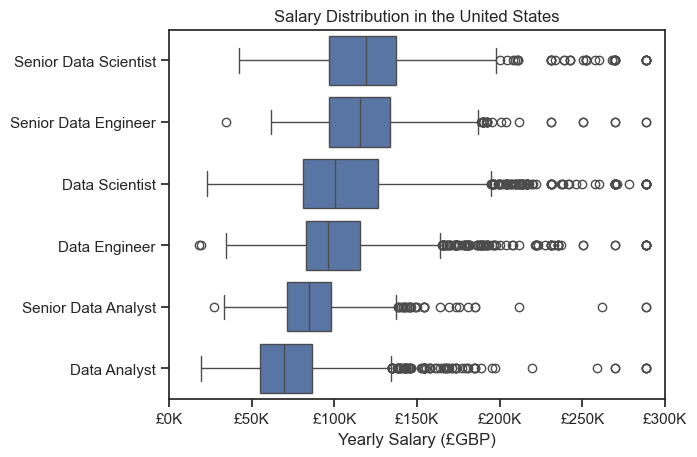

# The Analysis

## 1. What are the most demanded skills for the top 3 most popular data roles?

To find the most demanded skills for the top 3 data roles, I filtered out the positions with the highest count in my dataset, and got the top 5 skills mentioned for the top 3 roles. \
This showcases some valuable insights on what skills to focus on depending on the targetted role, alongside the financial compensation that can be expected upon using the skill.

View my notebook that outlines all the steps I took, with all comments intact:  [2_skills_demanded.ipynb](3_Project/2_skills_demand.ipynb)

### Visualise Data
```python
fig, ax = plt.subplots(len(job_titles), 1)

sns.set_theme(style="ticks")

for i, job_title in enumerate(job_titles):
    df_plot = df_skills_percent[df_skills_percent['job_title_short'] == job_title].head(5)
    sns.barplot(data=df_plot, x='skills_percent', y='job_skills', ax=ax[i], hue='skill_count', palette='dark:b_r')

    ax[i].set_title(job_title)
    ax[i].set_ylabel('')  
    ax[i].set_xlabel('')
    ax[i].get_legend().remove()
    ax[i].set_xlim(0, 75)

   
    for j, value in enumerate(df_plot['skills_percent']):
        ax[i].text(value + 1, j, f'{value:.0f}%', va="center")
    if i != len(job_titles) - 1:
        ax[i].set_xticks([])

fig.suptitle('Probability of Skills Requested in UK Job Postings', fontsize=15)
fig.tight_layout(h_pad=.5) 
plt.show()
```


### Results 


### Insights

- SQL is the most requested skill overall for Data roles in the UK, with over 40% of postings mentioning it as a required skill for both Data Analysts and Data Scientists, and 60% for Data Engineers. For Data Scientists, Python is the only skill mentioned more than SQL, included in 69% of postings.
- Python is a highly versatile skill in the Data industry, remaining highly demanded with the more technical roles of Data Engineers and Data Scientists (55% and 69% respectively). The demand is lower for that of Data Analysts, with more focus being on SQL and Excel. This makes sense, as Python is the worlds most popular programming language in AI development and machine learning, which is a core aspect of Data Science.
- Data Engineers require more specialised skills (AWS, Azure, Spark) compared to Data Scientist and especially Data Analysts, who are expected to be proficient in more general data management tools (Excel, Tableau, Power BI).

### Summary
Data Analysts focus on data querying, reporting, and visualisation, with strong skills in SQL, Excel, and tools like Power BI and Tableau.
Data Engineers are heavily involved in building and managing data infrastructure, requiring strong SQL, Python, and cloud platform skills (Azure, AWS), as well as knowledge of big data tools like Spark.
Data Scientists emphasize data analysis, machine learning, and statistical modeling, with Python being paramount, supported by SQL, R, and some cloud platform knowledge.

## 2. How are the most in-demand skills for Data Analysts in the UK trending over time?

To find the trend of in-demand skills for Data Analysts over the course of 2023, I aggregated the UK Data Analyst data on a monthly basis, and created a new row for each skill in my data frame. I then converted to a pivot table, and took each mentioned skill as a fraction of the total job postings, to find the percentage of which each skill was mentioned. I took some steps to further clean up the data, and converted the month column from an integer value to abbreviations of the months string. From this I plotted the results using Seaborn, and formatted the graph for both visual clarity and aesthetics.

View my notebook that outlines all the steps I took, with all comments intact:  [3_skills_trend.ipynb](3_Project\3_skills_trend.ipynb)

### Visualise Data

```python

sns.lineplot(data=df_plot, dashes=False, palette='tab10')
sns.set_theme(style="ticks")
sns.despine()

plt.title('Trend of Top Skills for Data Analysts over time in the UK')
plt.ylabel('Likelihood of Skill Appearing in Job Posting')
plt.xlabel('2023')
plt.legend().remove()

from matplotlib.ticker import PercentFormatter
ax = plt.gca()
ax.yaxis.set_major_formatter(PercentFormatter(decimals=0))

from adjustText import adjust_text
texts = []
for i in range(desired_value_no):
    text = plt.text(11.2, df_plot.iloc[-1, i], df_plot.columns[i]) 
    texts.append(text)

adjust_text(texts)
plt.show()

```

### Results


### Insights

- Excel and SQL are the most requested skills overall for Data Analysts in the UK, with both consistently appearing in over 40% of job postings throughout 2023. Excel maintained a steady presence, slightly leading over SQL in the latter part of the year. This trend highlights the critical importance of these skills in data manipulation and database management tasks typical for data analyst roles.
- Power BI and Python exhibit notable fluctuations in demand over the year. Power BI saw a significant increase, particularly from June to September, possibly reflecting the growing emphasis on data visualisation and business intelligence. Python also showed a spike in August, which may correlate with the release of new graduate roles. These positions often prioritise programming skills such as Python, given its versatility and widespread use in data analysis and automation.
- Tableau, while also important for data visualisation, shows a relatively stable but lower demand compared to Power BI. This might indicate a preference in the job market for Power BI over Tableau, or it could reflect organisational tool preferences and market trends.
- The spike in August across multiple skills could be attributed to a seasonal influx of job postings targeting recent graduates. New graduates are typically proficient in skills taught in academic settings, such as Python, which aligns with the observed increase in demand during this period.

### Summary

Data Analysts in the UK consistently need strong skills in Excel and SQL for core data tasks such as querying, reporting, and database management. Power BI and Python are also increasingly important, reflecting a growing need for data visualisation and programming capabilities. The seasonal spike in skill demand during August likely aligns with the job market's intake of new graduates, who bring current, academic knowledge of tools like Python. Tableau remains a relevant skill, though slightly less in demand compared to Power BI, possibly due to differing market and organisational tool preferences. \
The graph essentially reinforces the idea that learning these skills would still be beneficial in the workplace for a Data Analyst, at least for the time being. If we were to see a general decline over the course of the year, it would suggest that associated skill is being phased out. It may be interesting to see more data on this, as over a longer time span trends may become more apparant.

## 3. What are the trends in salary for Data Roles in the UK?

To find how well data roles pay in the UK, I filtered jobs for only in the UK, and selected the top 6 roles by count. I then made sure to sort by their medians to ensure a clear and visually appealing set of boxplots. Overall this was the easiest piece of analysis to complete, yet it still provides some valuable insights.

View my notebook that outlines all the steps I took, with all comments intact:  [4_salary_analysis.ipynb](3_Project\4_salary_analysis_uk.ipynb)

### Visualise Data
```python
sns.boxplot(data=df_uk_top, x='salary_year_avg', y='job_title_short', order=job_order)
sns.set_theme(style="ticks")

plt.title('Salary Distribution in the United Kingdom')
plt.xlabel('Yearly Salary (£GBP)')
plt.ylabel('')
ax = plt.gca()
ax.xaxis.set_major_formatter(plt.FuncFormatter(lambda x, pos: f'£{int(x/1000)}K'))
plt.show()
```

### Results


### Insights

- Senior Data Scientists command the highest salaries among the roles presented, with a wide interquartile range (IQR) indicating significant variation in pay. The median salary is high, reflecting the advanced skills and experience required for this role. The range extends from approximately £75K to over £175K, suggesting that the top earners in this position are very well compensated.

- Data Engineers have a relatively broad salary distribution, with their IQR indicating moderate variation in compensation. The median salary is around the £75K mark, with the range extending from about £50K to just over £125K. This spread highlights the demand for professionals who can build and manage complex data infrastructure.

- Data Scientists show a slightly narrower salary range compared to Data Engineers but still enjoy a substantial median salary around £75K. The distribution spans from approximately £50K to £125K, indicating a strong demand for skills in data analysis, machine learning, and statistical modeling.

- Data Analysts have the lowest median salary among the roles analysed, around £50K. The range is narrower, extending from approximately £25K to £75K, which aligns with the less technical but critical role they play in data querying, reporting, and visualisation.

- There is very limited data for the 'Senior Data Analyst' and 'Senior Data Engineer' roles, which precludes a detailed analysis. Their inclusion is intended to highlight the need for more data to provide a comprehensive salary analysis and to facilitate comparisons.

- To supplement this analysis, we will examine salary distributions for these roles in the US, where data is more abundant. This comparison will offer insights into global trends and highlight differences in compensation across regions.

### Performing the same analysis on US data

Following all the steps laid out above on data from the United States leads to the following results: \
View my notebook that outlines all the steps I took, with all comments intact:
[5_salary_analysis_us.ipynb](3_Project\5_salary_analysis_us.ipynb)


At first look, we can see that there are a lot more outliers included in the plots, but as box plots are, by definition, inclusive of 50% of their data within their IQRs, this is simply due to the far greater amount of data available in the US. \
Interestingly, In the US Senior Data Analysts are, on average, compensated less than that of non-senior data science and engineering roles. This suggests that a data analyst deciding whether to pursue a senior role, should perhaps instead progress into engineering or science instead. \
As expected, Senior Data Scientists and Engineers are paid highest on average, which reflects the strong technical skills and years experience needed to succeed in the roles. \
In general, salaries are higher in the US (this plot still uses £GBP as currency for the sake of consistency), which again is consistent with other data sources.

Overall, the analysis highlights that Senior Data Scientists have the highest and most variable salaries, reflecting their advanced skills and experience. Data Engineers and Data Scientists also enjoy substantial median salaries, indicating strong demand for their expertise. Data Analysts earn the lowest median salary, consistent with their less technical role.

Limited data on 'Senior Data Analyst' and 'Senior Data Engineer' roles suggests the need for more comprehensive information. US data shows higher overall salaries and reinforces the trend that advanced technical roles command higher pay. Future analyses would benefit from a more extensive data set in the UK, particularly for senior positions.

## 4. How do skills affect the median salary of a Data Analyst in the UK?

To find the top paying skills for Data Analysts, I began by filtering the dataset to only add Data Analyst roles in the UK to my data frame. I then summed all the skills and sorted by their median salaries, ensuring to remove anomalous data; which I defined to be skills that were mentioned less than 3 times in all postings. I then sorted the same data by count (or how many times each skill was mentioned in the data frame) to find the most desired skills. Finally I plotted these as a pair of bar charts on the same set of axes, as I decided this would be the clearest way of depicting the data. \
View my notebook that outlines all the steps I took, with all comments intact:
[6_skills_salary.ipynb](3_Project/6_skills_salary.ipynb)

### Remove Outliers
```python
df_da_top_pay = (df_da_uk.groupby('job_skills')['salary_year_avg']
                 .agg(['count', 'median'])
                 .query('count >= 3')  # keep only skills with 3 or more counts
                 .sort_values(by='median', ascending=False)
                 .head(10))
```
### Visualise Data
```python
fig, ax = plt.subplots(2, 1)

sns.barplot(data=df_da_top_pay, x='median', y=df_da_top_pay.index, ax=ax[0], hue='median', palette='dark:b_r')

sns.barplot(data=df_da_top_skills, x='median', y=df_da_top_skills.index, ax=ax[1], hue='median', palette='light:b')

plt.show()
```

### Results


### Insights

### Summary

## 5. What are the most optimal skills to learn for Data Analysts?


View my notebook that outlines all the steps I took, with all comments intact: [7_optimal_skills.ipynb](3_Project/7_optimal_skills.ipynb)
### Create a list of technologies that encompasses each skill

```python
df_tech = df['job_type_skills'].drop_duplicates().dropna().copy()

tech_dict = {}
for row in df_tech:
    row_dict = ast.literal_eval(row)
    for key, value in row_dict.items():
        if key in tech_dict:
            tech_dict[key] += value
        else:                
            tech_dict[key] = value

for key, value in tech_dict.items():
    tech_dict[key] = list(set(value))
```

### Visualise Data
```python
sns.scatterplot(
    data=df_plot,
    x='skill_percent',
    y='median_salary',
    hue='Technology'
)
```

### Results


### Insights


### Summary


## Conclusion


